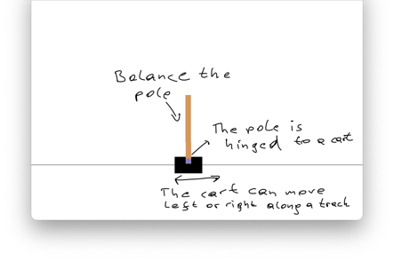

# Exercise - Cart-Pole Balance with DQN

In this example, we learn to control a classical control problem called *Cart-Pole*.
The state space is low-dimensional but continuous, making it an excellent environment for developing algorithms: training is fast, yet still somewhat challenging, and function approximation can help.

## This is the cart-pole environment



1) The cart-pole environment consists of balancing a pole.  
2) The pole is hinged to a cart.  
3) The cart can move left or right along a track.  

Its state space is comprised of four variables:

- The cart position on the track (x-axis), ranging from –2.4 to 2.4  
- The cart velocity along the track (x-axis), ranging from –∞ to ∞  
- The pole angle, approximately from –40 degrees to 40 degrees  
- The pole velocity at the tip, ranging from –∞ to ∞  

There are two available actions in every state:

- Action 0 applies a –1 force to the cart (push it left)  
- Action 1 applies a +1 force to the cart (push it right)  

You reach a terminal state if:

- The pole angle is more than 12 degrees from the vertical position  
- The cart center is more than 2.4 units from the center of the track  
- The episode count reaches 500 time steps  

The reward function is +1 for every time step.

---

- Write a DQN algorithm as given in the lecture. Show the cumulative reward of your agent as a function of the episodes during training and validate the result on 100 episodes.  
  What is the cumulative average reward of the 100 episodes?  
  A good practice is to average the results over five different random seeds and show the standard deviation.

- Good luck 🙂🙃😉

---

## DQN Implementation Template (Python Script)

The script `Classical_DQN_solution_template.py` provides a template to implement a Deep Q-Network (DQN) agent for solving the Cart-Pole environment using reinforcement learning.

### Purpose

This script is designed as a guided exercise for students to:
- Understand the main components of a DQN agent
- Implement missing parts of the DQN training pipeline
- Explore function approximation, experience replay, and target networks in practice

The agent is trained in the `CartPole-v1` environment from OpenAI's Gymnasium library.

---

### Code Overview

The script includes the following key components:

- **ReplayBuffer**  
  Stores past experiences (state transitions), enabling training from random batches of experience. This breaks the correlation between sequential steps and stabilizes learning.

- **DQN Class**  
  Contains:
  - The neural network definition (`nn_model`)
  - The epsilon-greedy action selection (`get_action`)
  - Prediction and training logic

  👉 *Students need to implement the neural network and epsilon-greedy action selection policy.*

- **Agent Class**  
  Responsible for:
  - Interacting with the environment
  - Storing experiences
  - Sampling batches for training
  - Updating both the main and target networks

  👉 *Students need to implement the training logic using the replay buffer and target network updates.*

- **Training Loop (`Agent.train`)**  
  Handles the full RL loop over multiple episodes:
  - Selects actions using the current DQN
  - Steps the environment
  - Adds experiences to the buffer
  - Trains the model once enough data is collected
  - Periodically updates the target network
  - Applies epsilon decay to reduce exploration over time

- **Logging**
  Training logs are stored using TensorBoard. You can inspect training metrics by running:
  ```bash
  tensorboard --logdir logs
  
---
Please ask if anything is not clear, don't hesitate!